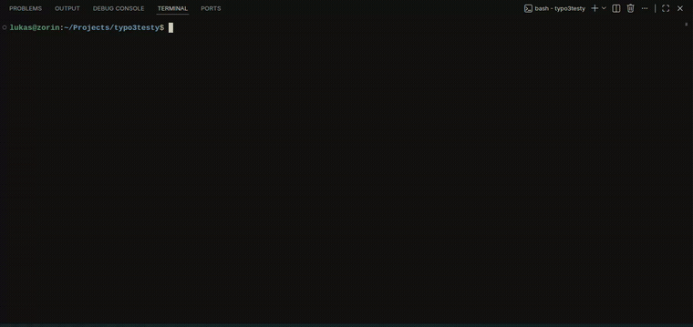

# typo3quickstarter

One-command bash script that spins up disposable TYPO3 instances on [DDEV](https://ddev.com). Pick a version (or let it grab the latest), and it configures DDEV, installs TYPO3 via Composer, sets up the database and an admin user, drops the credentials into a local file, and opens the backend in your browser.

Built because roughly half of all TYPO3 sites out there are still running on old major versions — this makes it trivial to spin up several versions side by side and see what actually changed.



## Why

- **One command, zero clicking through the install wizard.** No more re-typing DB credentials or admin passwords by hand.
- **Test against multiple TYPO3 versions in parallel.** Each instance gets its own name, its own DDEV project, its own URL.
- **Disposable by design.** Spin one up, break it, tear it down. `--cleanup` gets rid of the mess for you.

## Prerequisites

- [Docker](https://www.docker.com/)
- [DDEV](https://ddev.com/get-started/) (v1.22+)

The script checks for both and bails out early with a clear error if either is missing or Docker isn't running.

## Installation

```bash
git clone https://github.com/pagea-dev/typo3quickstarter.git
cd typo3quickstarter
chmod +x typo3-ddev-setup.sh
```

Or just grab the single file — it has no other dependencies beyond `bash`, `docker`, and `ddev`.

## Usage

```bash
./typo3-ddev-setup.sh --release=13
```

No `--release`? It defaults to the newest supported major version:

```bash
./typo3-ddev-setup.sh
```

That's it. The script will:

1. Create a project folder named e.g. `typo3-v13-a1b2` (or use `--name` if you gave one)
2. Run `ddev config` with the right PHP version for that TYPO3 release
3. Install TYPO3 via `ddev composer create`
4. Run the non-interactive TYPO3 setup (database, admin user, default site)
5. Write the login details to `typo3-credentials.txt` in the project folder
6. Open `/typo3` (the backend) in your browser via `ddev launch`

At the end you'll see something like:

```
==> Done.
URL:         https://typo3-v13-a1b2.ddev.site
Backend:     https://typo3-v13-a1b2.ddev.site/typo3
Admin:       admin
Password:    Ddev-482913605-Aa1
Credentials: /home/you/projects/typo3-v13-a1b2/typo3-credentials.txt
```

> The very first time DDEV adds a new `*.ddev.site` hostname to your system, it needs `sudo` to update `/etc/hosts` — you'll get a normal password prompt for that. It only happens once per hostname.

### Options

| Flag | Description | Default |
|---|---|---|
| `-r=N`, `--release=N` | TYPO3 version to install — see [docs/versions.md](docs/versions.md) | highest supported |
| `--name=NAME` | DDEV project name | auto-generated, e.g. `typo3-v13-a1b2` |
| `--path=DIR` | Where the project folder is created (also used by `--cleanup`) | current directory |
| `--admin-user`, `--admin-password`, `--admin-email` | Primary admin backend user — see [docs/backend-users.md](docs/backend-users.md) | `admin` / random / `admin@<project>.ddev.site` |
| `--beuser`, `--bepass`, `--bemail` | Create an additional admin backend user — see [docs/backend-users.md](docs/backend-users.md) | — |
| `--cleanup` | Interactively remove previously created instances — see [docs/cleanup.md](docs/cleanup.md) | — |
| `-h`, `--help` | Show usage | — |
| `--version` | Show the script's own version — see [docs/versioning.md](docs/versioning.md) | — |

## Documentation

- [docs/versions.md](docs/versions.md) — selecting a version, pinning an exact patch release, the `--no-security-blocking` security note, TYPO3 v11 quirks
- [docs/backend-users.md](docs/backend-users.md) — the primary admin user and additional backend users via `--beuser`
- [docs/cleanup.md](docs/cleanup.md) — `--cleanup` walkthrough
- [docs/versioning.md](docs/versioning.md) — the script's own `--version` and the release process
- [CHANGELOG.md](CHANGELOG.md) — what changed in each version

## Notes

- `typo3-credentials.txt` is written outside the `public/` docroot, so it's never reachable over HTTP, and it gets `chmod 600` plus an entry in `.gitignore` automatically.

## License

MIT — see [LICENSE](LICENSE).
